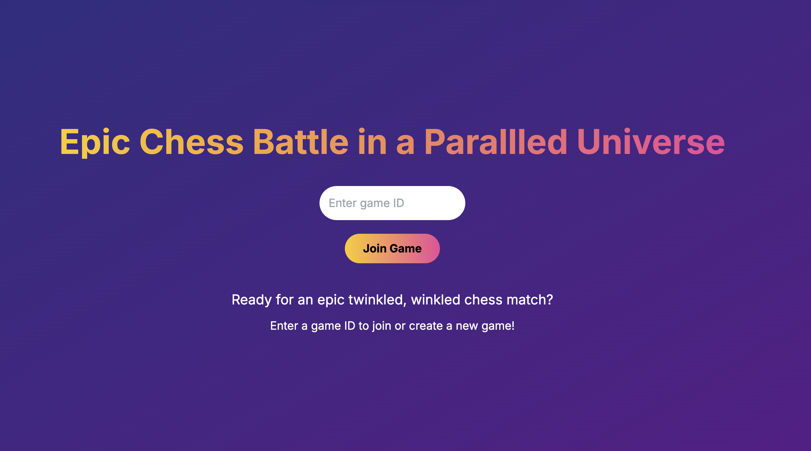
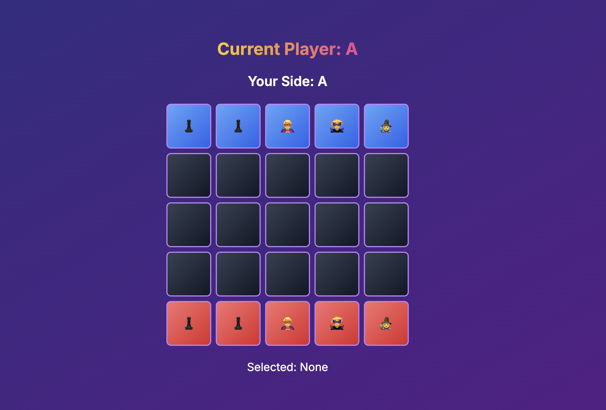
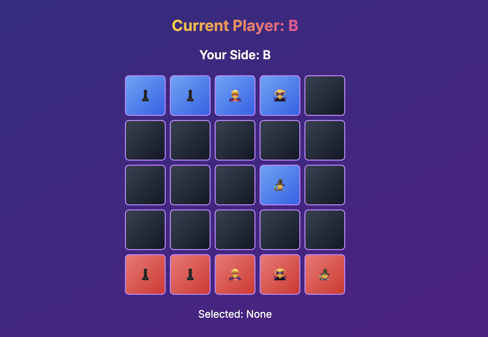

<div align="center">

# **Quirky Chess Game 👩🏼‍💻**
> The quirky chess game is a special project made for Hitwicket supporting multiple clients including spectators.
</div>

## Wait a minute! What makes it __unique__ though?
1. Fun and Intuitive UI
2. Playful Characters, support for two friends playing this game, while others spectate
3. Create and join Private Rooms to play and have fun
4. Made with Next Js and Typesript - Making the code extremely easy to mainatin
5. Capability to access the game through the whole local network - Yay!
<br/>



## Getting Started:
1. Install Packages and Modules
```shell
npm i
```
2. Start the Server - Server.js
```shell
node server.js
```
3. Start Next Js Server
```shell
npm run dev --turbo
```
4. Play and enjoy
> Put any random number sequence when asked to create a room, and enter that same number sequence if another person wants to join the game room

__Note: This game can't be hosted on any edge hosting provider such as vercel, and has to be hosted on a sperate VPS - as there's a seperate Server to handle communications between server and client's through the websocket protocol__
